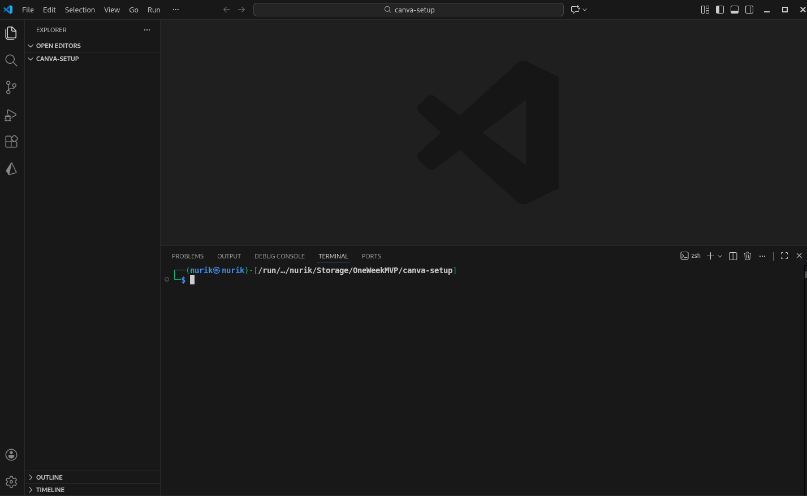
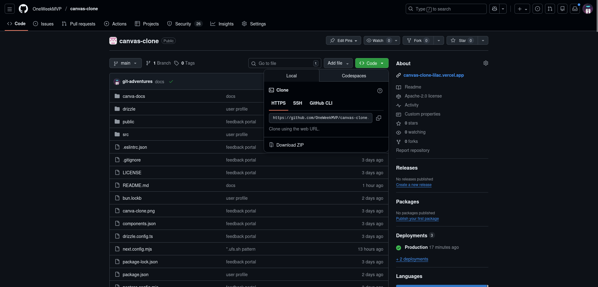
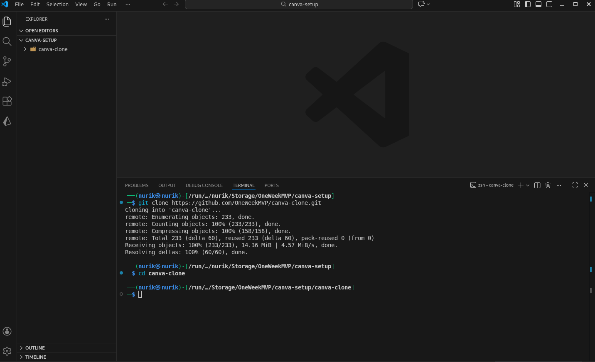
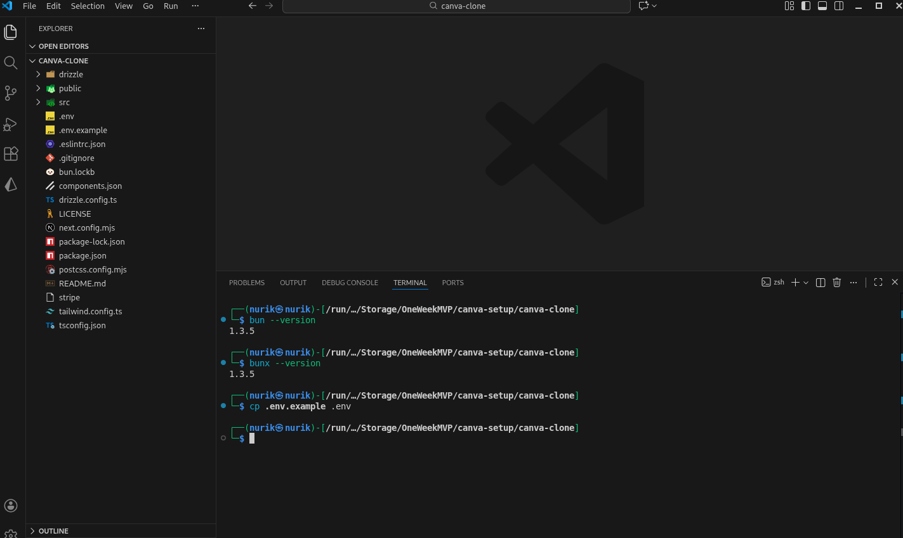
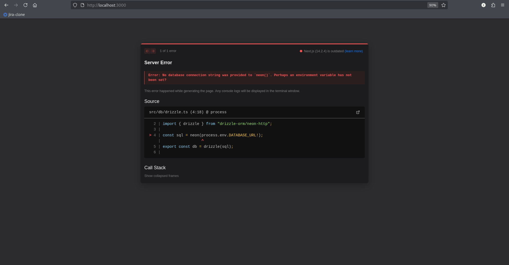

# 01-INSTALLATION.md

## Installation

### Step 1: Clone the Repository

Open your terminal and run:

```bash
git clone https://github.com/Davronov-Alimardon/canva-clone.git
cd canva-clone
```

**See:** Fig.1.0, Fig.1.1, Fig.1.2.

  
<p align="center"><em>Fig.1.0: Create a project folder.</em></p>

  
<p align="center"><em>Fig.1.1: Grab the HTTPS URL.</em></p>

  
<p align="center"><em>Fig.1.2: Clone and change the directory.</em></p>

### Step 2: Copy Environment File

```bash
cp .env.example .env
```

**See:** Fig.1.3.

  
<p align="center"><em>Fig.1.3: Check for versions and copy .env.example</em></p>

### Step 3: Check Your Package Manager

If using Bun:
```bash
bun --version
# Should output: 1.3.5 or higher
```

If using npm:
```bash
node --version
# Should output: v18.0.0 or higher
```

### Step 4: Install Dependencies

Using Bun:
```bash
bun install
```

Using npm:
```bash
npm install
```

**What this does:** Downloads all project dependencies into `node_modules` folder.

### Step 5: Test Run (Will Fail - Expected!)

```bash
bun dev
# or
npm run dev
```

You'll see this error:
```
Error: No database connection string was provided to `neon()`. 
Perhaps an environment variable has not been set?
```

**This is normal!** We'll fix it in the next step by setting up the database.

**See:** Fig.1.4.

  
<p align="center"><em>Fig.1.4: Database URL, missing it in .env file</em></p>

---

**Previous:** [00-PREREQUISITES.md](./00-PREREQUISITES.md)  
**Next:** [02-DATABASE-SETUP.md](./02-DATABASE-SETUP.md)

---
