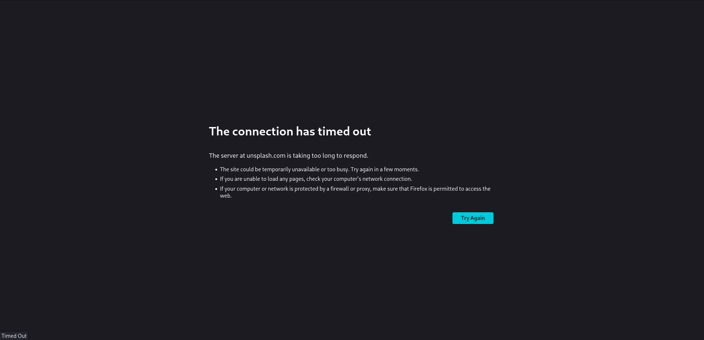
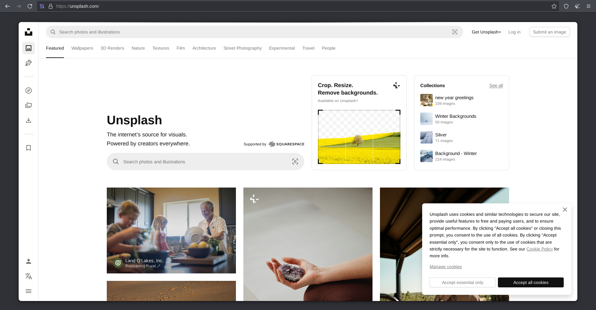
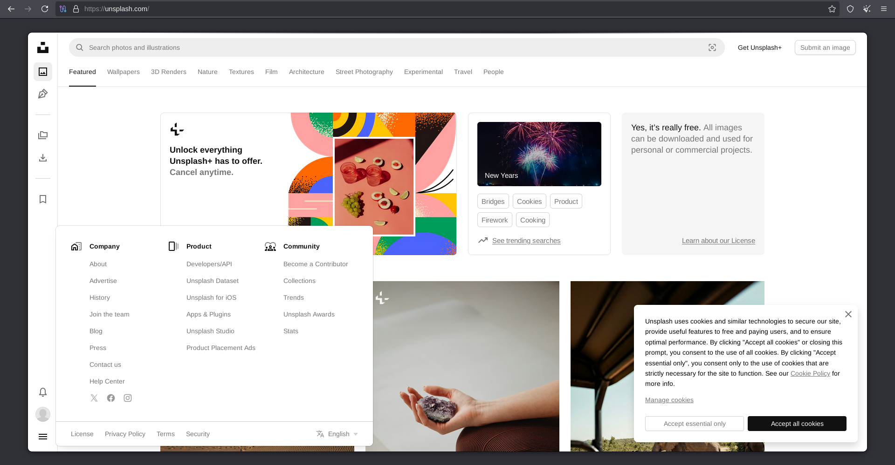
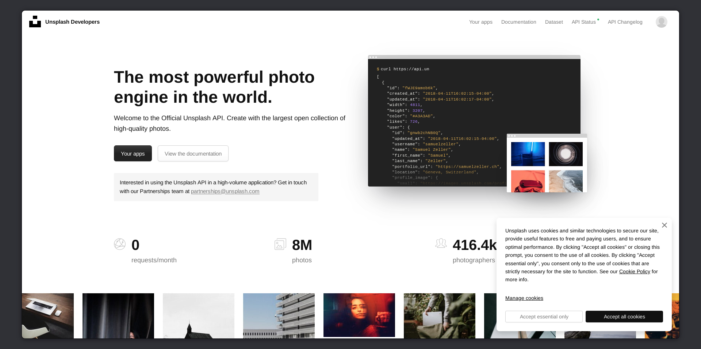
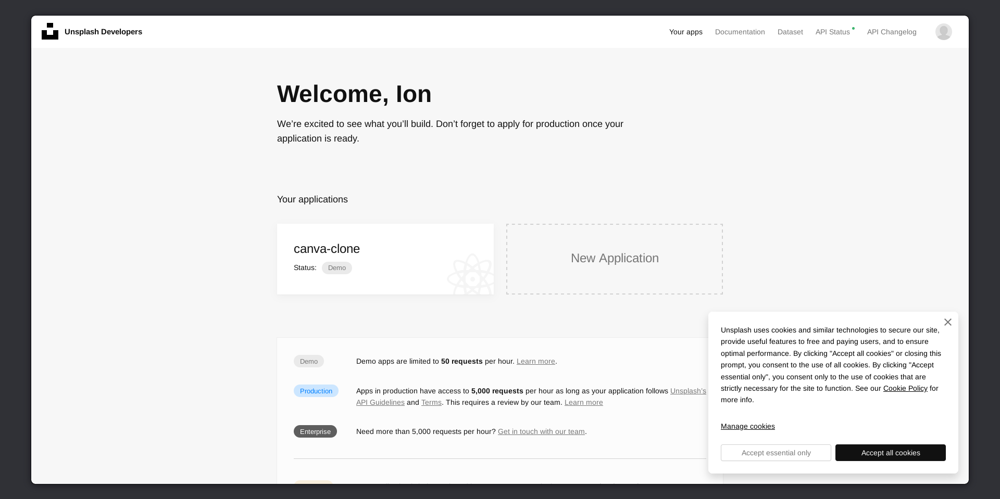
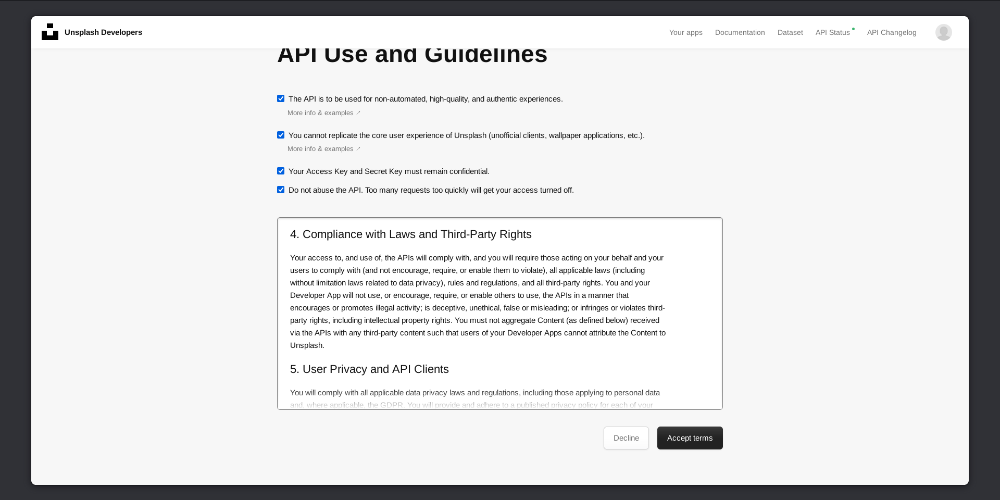
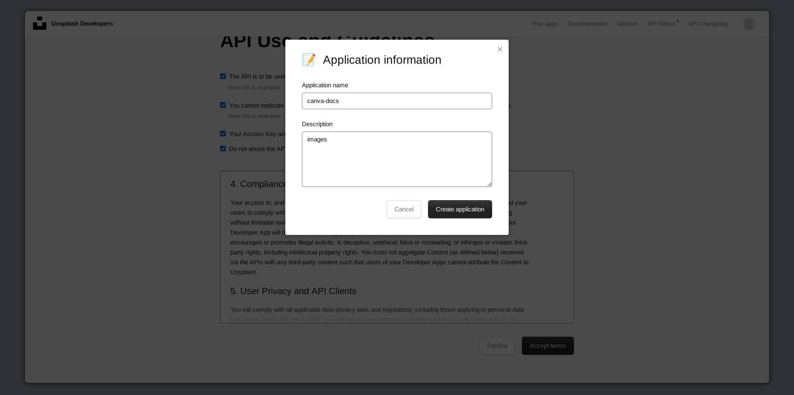
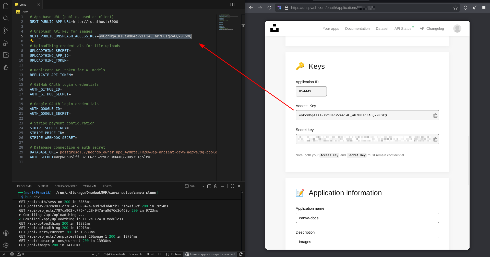
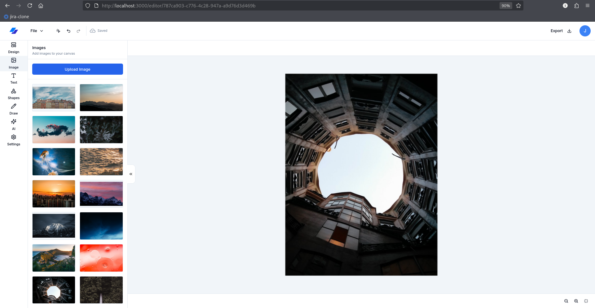

# 03-UNSPLASH-API.md

## Unsplash API Setup (Stock Photos)

### Step 1: Create Unsplash Account

1. Go to [unsplash.com](https://unsplash.com)
2. Sign up or log in

**Troubleshooting:** If you get connection errors, try using Tor Browser: [torproject.org/download](https://www.torproject.org/download)

**See:** Fig.3.0, Fig.3.1, Fig.3.2.

  
<p align="center"><em>Fig.3.0: Before the integration with Unplash and Uploadthing APIs</em></p>

  
<p align="center"><em>Fig.3.1: Connection Error</em></p>

  
<p align="center"><em>Fig.3.2: Unsplash via Tor</em></p>

### Step 2: Access Developer API

1. Click on **"Product"** in the menu
2. Select **"Developers/API"**

**See:** Fig.3.3.

  
<p align="center"><em>Fig.3.3: Select Developers API</em></p>

### Step 3: Create Application

1. Click **"Your apps"**
2. Click **"New Application"**
3. Accept the terms and conditions
4. Name your application (e.g., "Canva Clone")
5. Submit

**See:** Fig.3.4, Fig.3.5, Fig.3.6, Fig.3.7.

  
<p align="center"><em>Fig.3.4: Select ‘Your apps’</em></p>

  
<p align="center"><em>Fig.3.5: Create an app</em></p>

  
<p align="center"><em>Fig.3.6: Accept terms</em></p>

  
<p align="center"><em>Fig.3.7: Name your app with a few words</em></p>


### Step 4: Get Access Key

1. In your app dashboard, find **"Access Key"**
2. Copy the key

**See:** Fig.3.8.

  
<p align="center"><em>Fig.3.8: Grab your Access Key</em></p>

### Step 5: Add to Environment File

Open `.env` and add:

```env
NEXT_PUBLIC_UNSPLASH_ACCESS_KEY=your_access_key_here
```

### Step 6: Restart Dev Server

```bash
# Stop the server (Ctrl+C)
# Start again
bun dev
```

### Step 7: Test Unsplash Integration

1. Open `http://localhost:3000`
2. Click on a project or create new one
3. Click **"Image"** in the left sidebar
4. You should see Unsplash photos!

**See:** Fig.3.9.

  
<p align="center"><em>Fig.3.9: Unsplash is set</em></p>

---

**✅ Unsplash API setup complete!**

---

**Previous:** [02-DATABASE-SETUP.md](./02-DATABASE-SETUP.md)  
**Next:** [04-UPLOADTHING-API.md](./04-UPLOADTHING-API.md)

---
