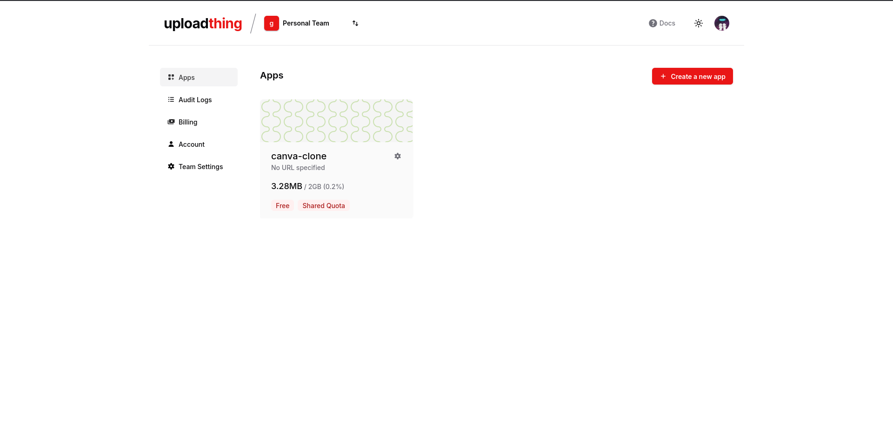
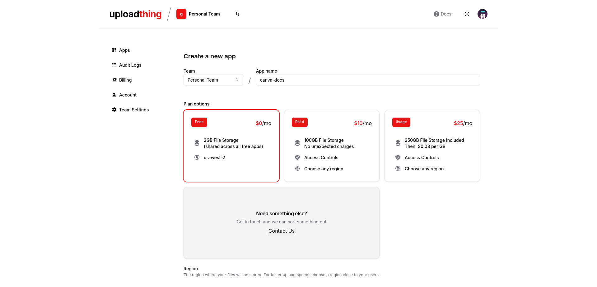
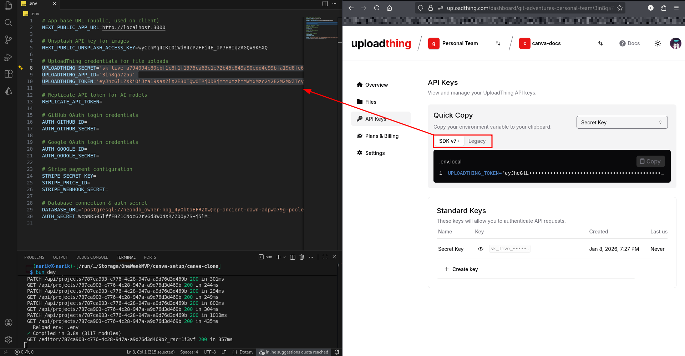

# 04-UPLOADTHING-API.md

## UploadThing API Setup (File Uploads)

### Step 1: Create UploadThing Account

1. Go to [uploadthing.com](https://uploadthing.com)
2. Click **"Get Started for Free"**
3. Sign up or log in

**See:** Fig.4.0.

  
<p align="center"><em>Fig.4.0: Projects Dashboard</em></p>

### Step 2: Create New App

1. In your dashboard, click **"New App"**
2. Name your app (e.g., "Canva Clone")
3. Select **"Free"** plan
4. Click **"Create App"**

**See:** Fig.4.1.

  
<p align="center"><em>Fig.4.1: Name && Select Free</em></p>

### Step 3: Get API Keys

You need to copy **3 different keys**:

1. **SDK v7+ Keys:**
   - `UPLOADTHING_SECRET`
   - `UPLOADTHING_APP_ID`

2. **Legacy Token:**
   - `UPLOADTHING_TOKEN`

**See:** Fig.4.2.

  
<p align="center"><em>Fig.4.2: SDK v7+ && Legacy</em></p>


### Step 4: Add to Environment File

Open `.env` and add all three:

```env
UPLOADTHING_SECRET=your_secret_here
UPLOADTHING_APP_ID=your_app_id_here
UPLOADTHING_TOKEN=your_token_here
```

### Step 5: Restart Dev Server

```bash
# Stop the server (Ctrl+C)
# Start again
bun dev
```

### Step 6: Test Upload Feature

1. Open `http://localhost:3000`
2. Open a project
3. Click **"Upload Image"** button
4. Select an image from your computer
5. Upload should work!

**See:** Fig.4.3.

  
<p align="center"><em>Fig.4.3: Upload Image</em></p>

---

**✅ UploadThing API setup complete!**

---

**Previous:** [03-UNSPLASH-API.md](./03-UNSPLASH-API.md)  
**Next:** [05-REPLICATE-API.md](./05-REPLICATE-API.md)

---
