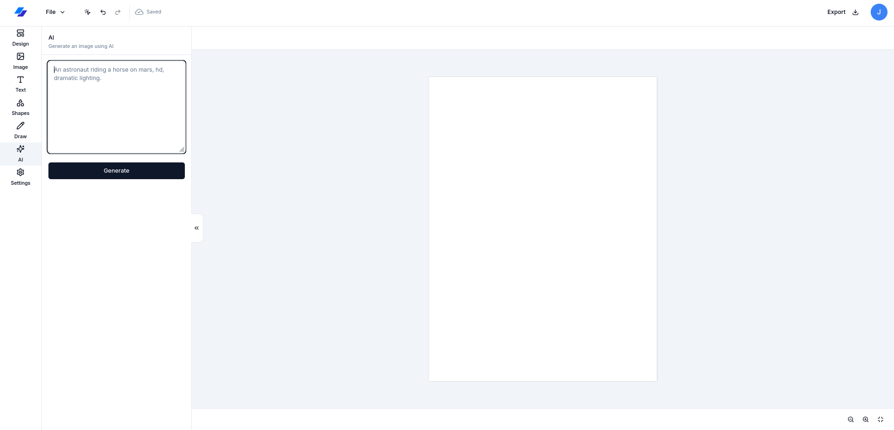
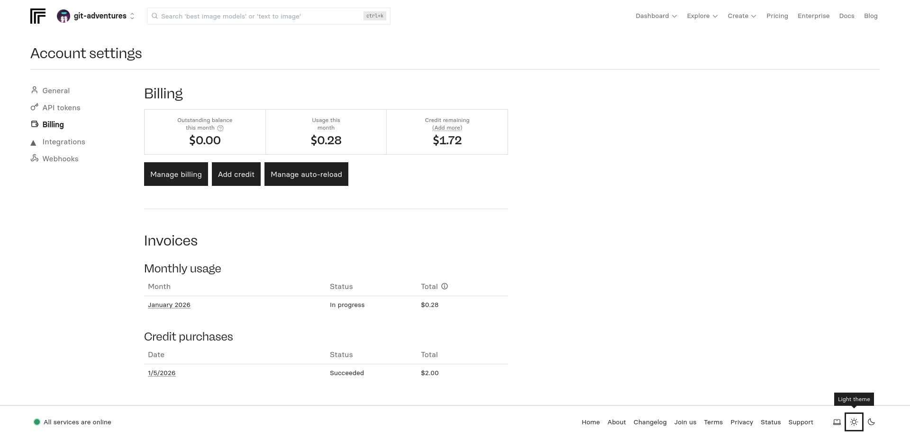
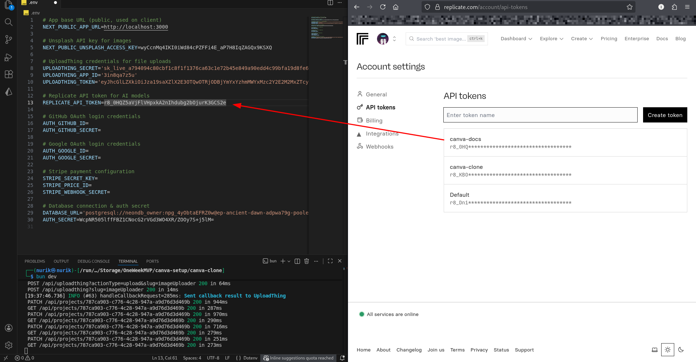
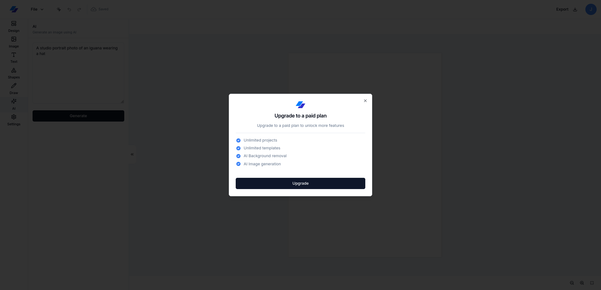

# 05-REPLICATE-API.md

## Replicate API Setup (AI Image Generation)

### ⚠️ Important Note

**Replicate requires billing credentials.** You need at least **$2** in your account to use AI image generation features.

**See:** Fig.5.0.

  
<p align="center"><em>Fig.5.0: Before AI</em></p>

### Step 1: Create Replicate Account

1. Go to [replicate.com](https://replicate.com)
2. Sign up for an account

### Step 2: Add Billing Information

1. Navigate to [replicate.com/account/billing](https://replicate.com/account/billing)
2. Click **"Add payment method"**
3. Add your credit/debit card
4. Add at least **$2** to your account

**See:** Fig.5.1.

  
<p align="center"><em>Fig.5.1: Replicate Billing Page</em></p>


### Step 3: Get API Token

1. Go to **"API tokens"** section
2. Click **"Create token"**
3. Name your token (e.g., "Canva Clone")
4. Copy the token

**See:** Fig.5.2.

  
<p align="center"><em>Fig.5.2: Replicate token</em></p>

### Step 4: Add to Environment File

Open `.env` and add:

```env
REPLICATE_API_TOKEN=your_replicate_token_here
```

### Step 5: Restart Dev Server

```bash
# Stop the server (Ctrl+C)
# Start again
bun dev
```

### Step 6: Test AI Generation (After Stripe Setup)

**Note:** AI features require a Pro subscription. You'll be able to test this after completing the Stripe setup in the next guide.

**See:** Fig.5.3.

  
<p align="center"><em>Fig.5.3: Paidwall && Next is Stripe</em></p>


---

**✅ Replicate API setup complete!**

---

**Previous:** [04-UPLOADTHING-API.md](./04-UPLOADTHING-API.md)  
**Next:** [06-STRIPE-SETUP.md](./06-STRIPE-SETUP.md)

---
