# 06-STRIPE-SETUP.md

## Stripe Setup (Payment Processing)

### ⚠️ This is the most complex setup - take your time!

**Estimated time:** 20-30 minutes

---

## Part 1: Stripe Account & API Key

### Step 1: Create Stripe Account

1. Go to [dashboard.stripe.com](https://dashboard.stripe.com)
2. Sign up for an account
3. Complete verification

**See:** Fig.6.0, Fig.6.1.

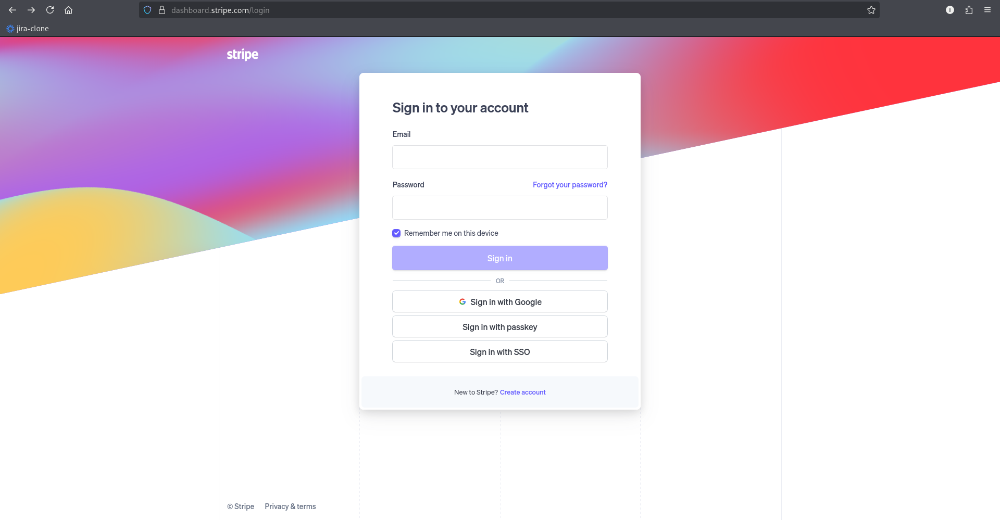  
<p align="center"><em>Fig.6.0: Stripe Dashboard</em></p>

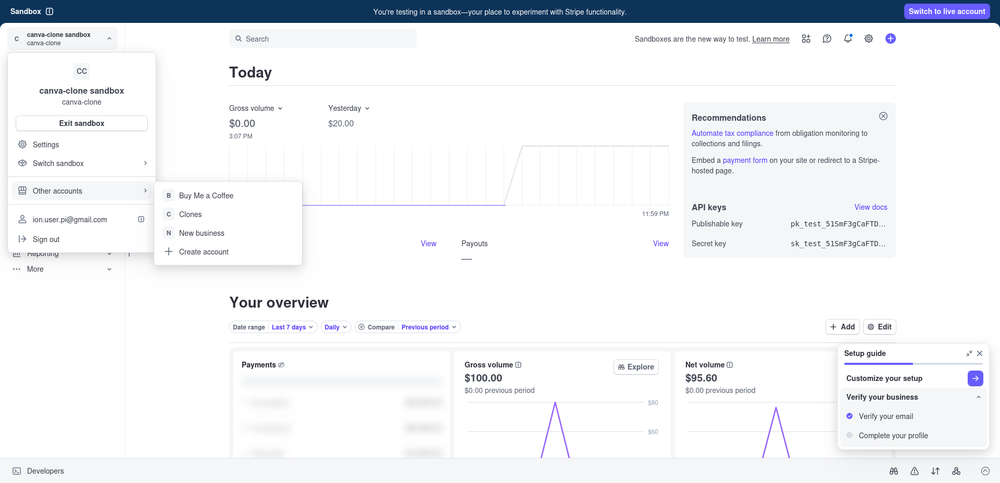  
<p align="center"><em>Fig.6.1: Create a new account</em></p>

### Step 2: Get Secret Key

1. Go to **"Developers"** → **"API keys"**
2. Copy your **"Secret key"** (starts with `sk_test_`)

**See:** Fig.6.2.

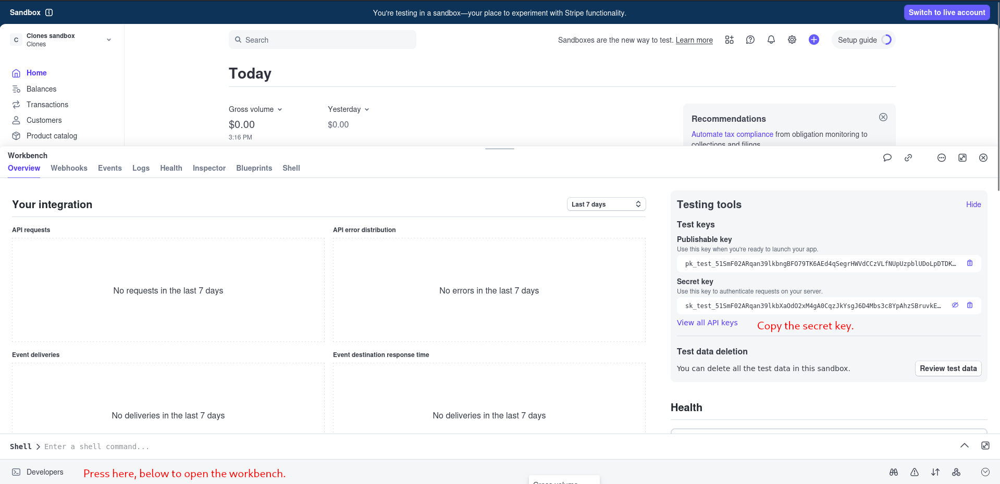  
<p align="center"><em>Fig.6.2: Secrete key</em></p>


### Step 3: Add to Environment File

Open `.env` and add:

```env
STRIPE_SECRET_KEY=sk_test_your_secret_key_here
```

**See:** Fig.6.3.

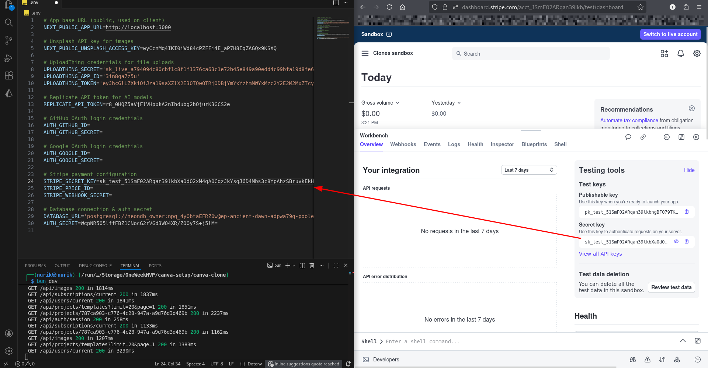  
<p align="center"><em>Fig.6.3: Fill the Stripe Secret Key in .env file</em></p>


---

## Part 2: Create Product

### Step 4: Create Subscription Product

1. Go to **"Products"** in Stripe Dashboard
2. Click **"Add product"**
3. Fill in details:
   - **Name:** "Pro Plan" (or your choice)
   - **Description:** Optional
   - **Pricing:** Add price
     - **Price:** Your amount (e.g., $9.99)
     - **Billing period:** Recurring - Monthly
4. Click **"Save product"**

**See:** Fig.6.4, Fig.6.5.

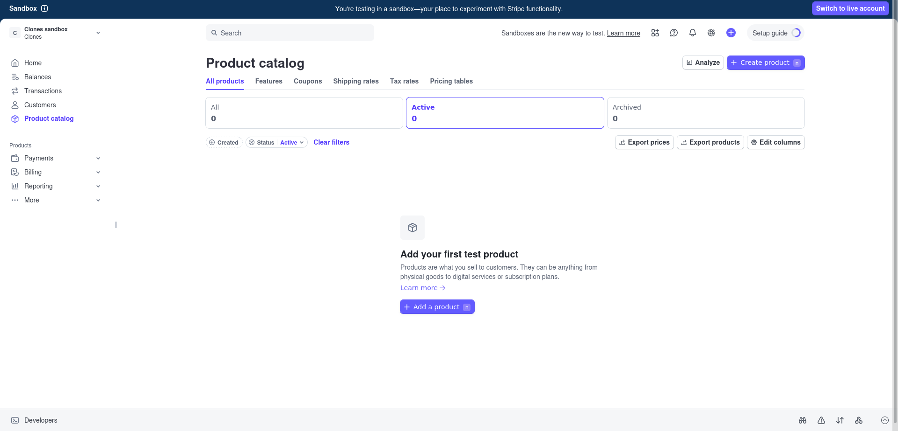  
<p align="center"><em>Fig.6.4: Adding product</em></p>

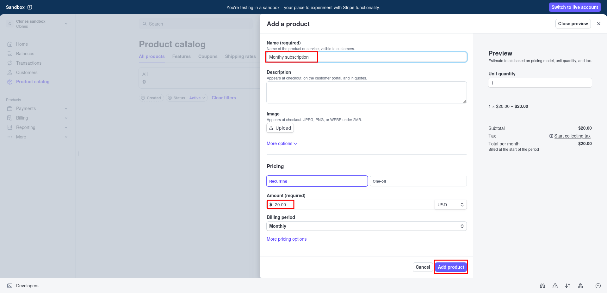  
<p align="center"><em>Fig.6.5: Product</em></p>


### Step 5: Copy Price ID

1. After saving, you'll see the product page
2. Copy the **Price ID** (starts with `price_`)

**See:** Fig.6.6.

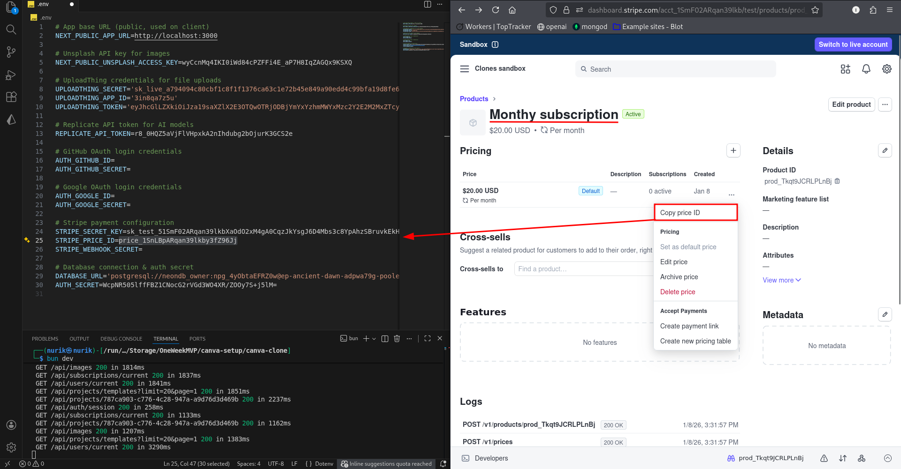  
<p align="center"><em>Fig.6.6: Copy price ID</em></p>

### Step 6: Add to Environment File

Open `.env` and add:

```env
STRIPE_PRICE_ID=price_your_price_id_here
```

---

## Part 3: Local Webhook Setup

### Step 7: Install Stripe CLI

Download for your operating system:
- [docs.stripe.com/stripe-cli/install](https://docs.stripe.com/stripe-cli/install)

Install in your project root folder.

**See:** Fig.6.7, Fig.6.8.

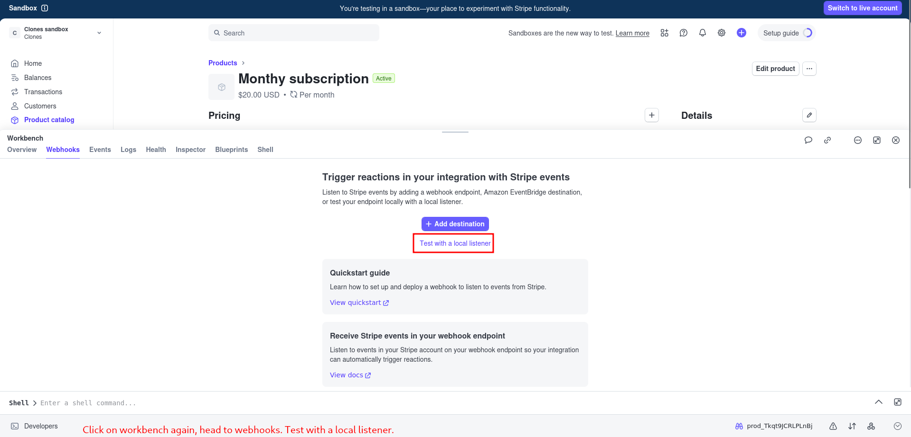  
<p align="center"><em>Fig.6.7: Test with a local listener</em></p>

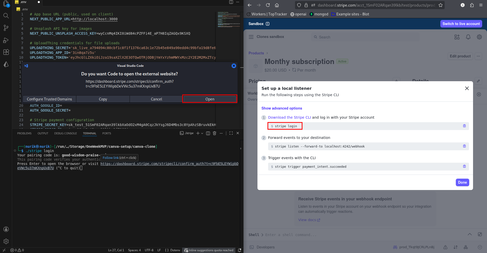  
<p align="center"><em>Fig.6.8: Local listener setup</em></p>

### Step 8: Login to Stripe CLI

Open a **new terminal** and run:

```bash
stripe login
```
or
```bash
./stripe login
```

This will open your browser - click **"Allow access"**

**See:** Fig.6.9, Fig.6.10.

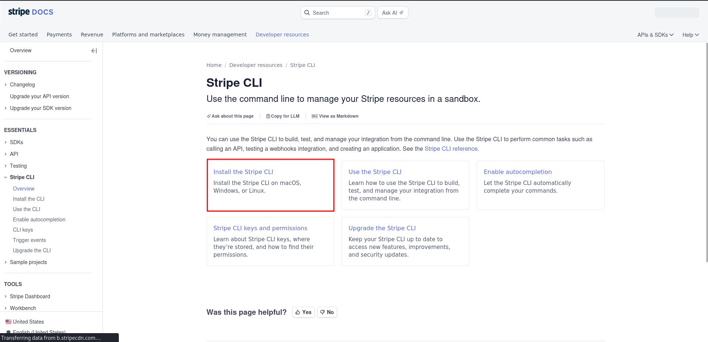  
<p align="center"><em>Fig.6.9: Stripe CLI</em></p>

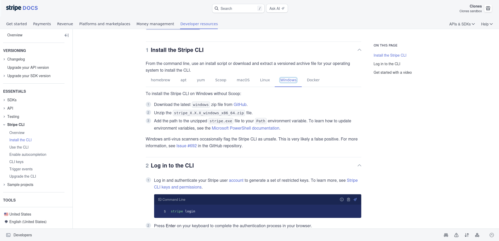  
<p align="center"><em>Fig.6.10: Go with the flow</em></p>

### Step 9: Start Webhook Listener

In the same terminal, run:

```bash
stripe listen --forward-to localhost:3000/api/webhooks/stripe
```
or
```bash
./stripe listen --forward-to localhost:3000/api/webhooks/stripe
```

**Important:** Keep this terminal window open! Don't close it.

You'll see output like:
```
> Ready! Your webhook signing secret is whsec_xxxxx
```

Copy the webhook secret (the part after `whsec_`).

**See:** Fig.6.11.

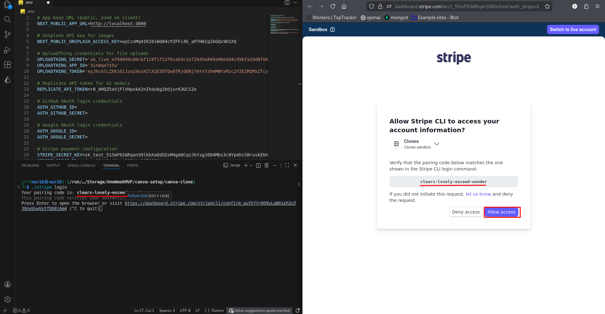  
<p align="center"><em>Fig.6.11: Allow access</em></p>

### Step 10: Add Webhook Secret to .env

Open `.env` and add:

```env
STRIPE_WEBHOOK_SECRET=whsec_your_webhook_secret_here
```

---

## Part 4: Test Payment Flow

### Step 11: Start Dev Server

Open a **NEW terminal** (keep the Stripe CLI terminal running) and run:

```bash
bun dev
```

### Step 12: Test Subscription

1. Open `http://localhost:3000`
2. Log in to your account
3. Click **"Upgrade to Pro"** or **"Subscribe"**
4. Use Stripe test card details:
   - **Card number:** `4242 4242 4242 4242`
   - **Expiry:** Any future date (e.g., 12/25)
   - **CVC:** Any 3 digits (e.g., 123)
   - **ZIP:** Any 5 digits (e.g., 12345)
5. Complete payment

**See:** Fig.6.12, Fig.6.13.

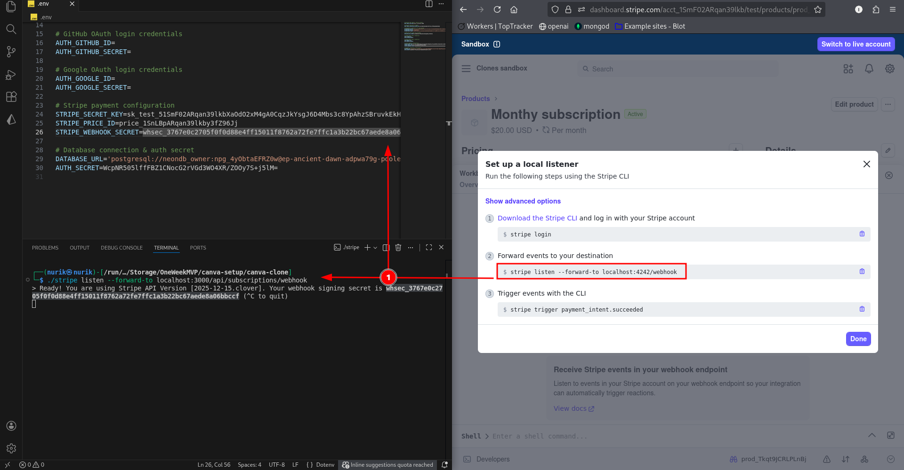  
<p align="center"><em>Fig.6.12: Stripe listen on localhost:3000</em></p>

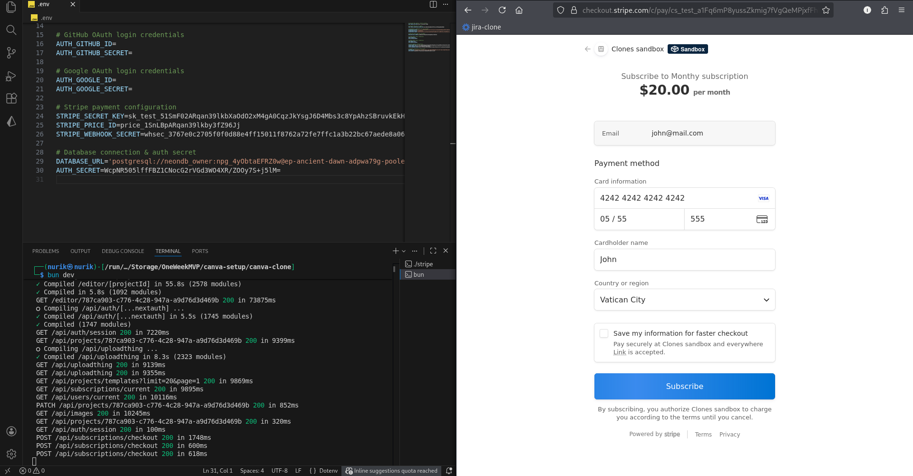  
<p align="center"><em>Fig.6.13: Dummy info && Subscribe</em></p>

### Step 13: Verify Subscription

1. Check your Stripe dashboard
2. You should see the payment in **"Payments"** section
3. Your account should now have Pro access!

---

## Part 5: Test AI Features

### Step 14: Test AI Image Generation

Now that you have Pro access:

1. Open a project
2. Click **"AI"** in the sidebar
3. Enter a prompt (e.g., "a beautiful sunset over mountains")
4. Click **"Generate"**
5. Wait for the AI to generate your image

**See:** Fig.6.14.

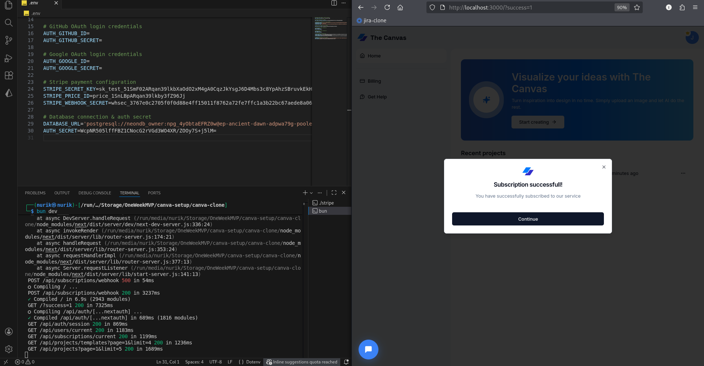  
<p align="center"><em>Fig.6.14: Successful</em></p>

### Step 15: Test Background Removal

1. Upload or select an image
2. Click **"Remove Background"**
3. Wait for processing
4. Your image background should be removed!

**See:** Fig.6.15, Fig.6.17.

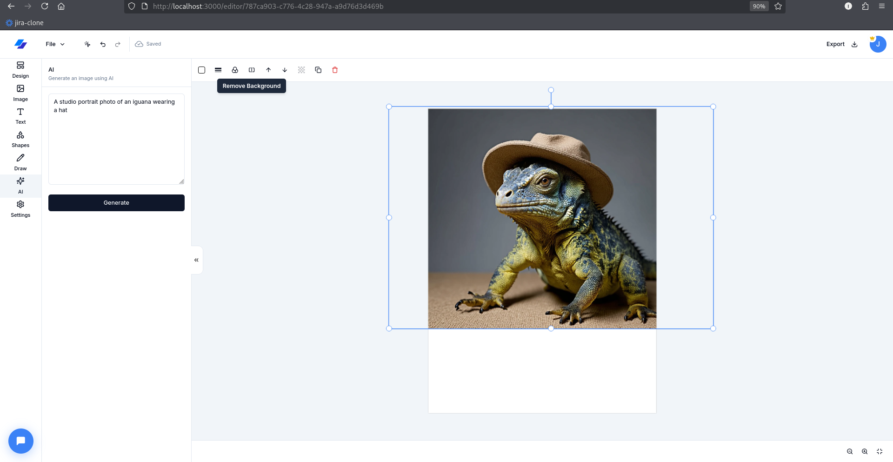  
<p align="center"><em>Fig.6.15: Image Generation</em></p>

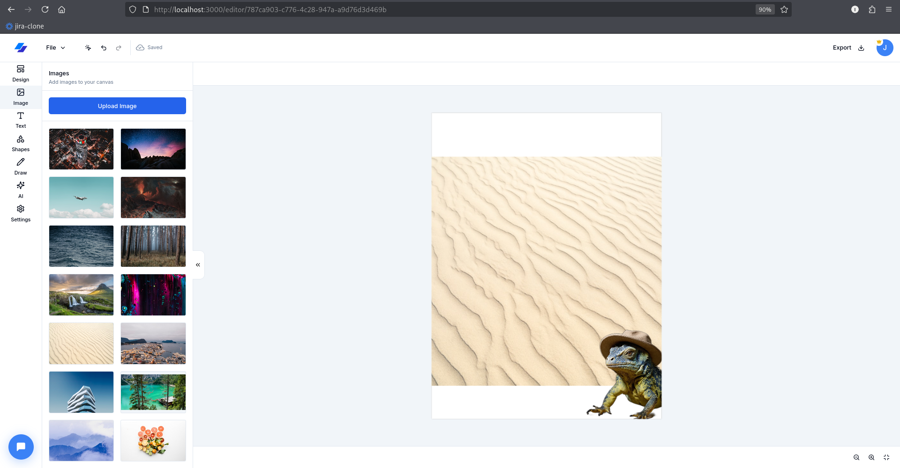  
<p align="center"><em>Fig.6.16: Go ahead and play</em></p>


---

**✅ Stripe setup complete! Payment processing is working!**

---

**Troubleshooting:**

**Webhook not receiving events:**
- Ensure Stripe CLI terminal is still running
- Check that webhook secret is correct in `.env`
- Restart both terminals if needed

**Payment fails:**
- Use the test card number exactly: `4242 4242 4242 4242`
- Make sure you're in test mode (not live mode)

---

**Previous:** [05-REPLICATE-API.md](./05-REPLICATE-API.md)  
**Next:** [07-TEMPLATES-SETUP.md](./07-TEMPLATES-SETUP.md)

---
