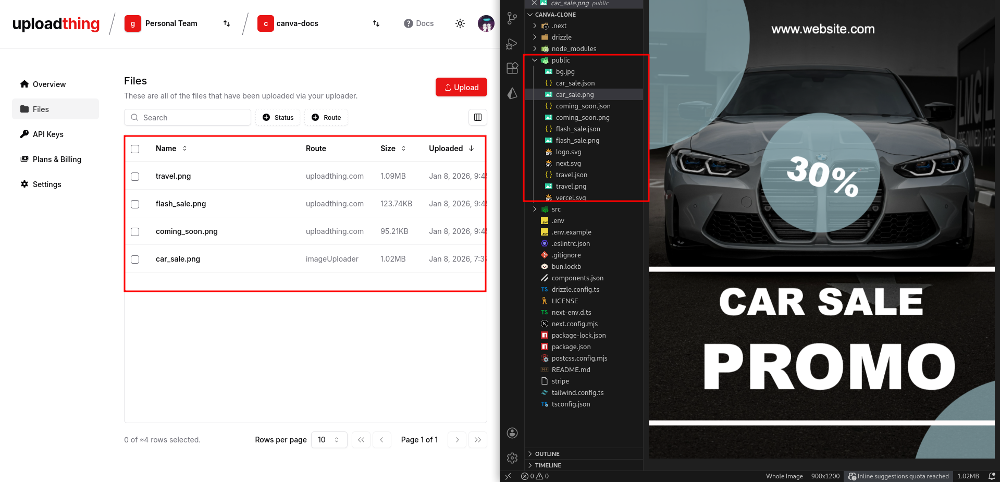
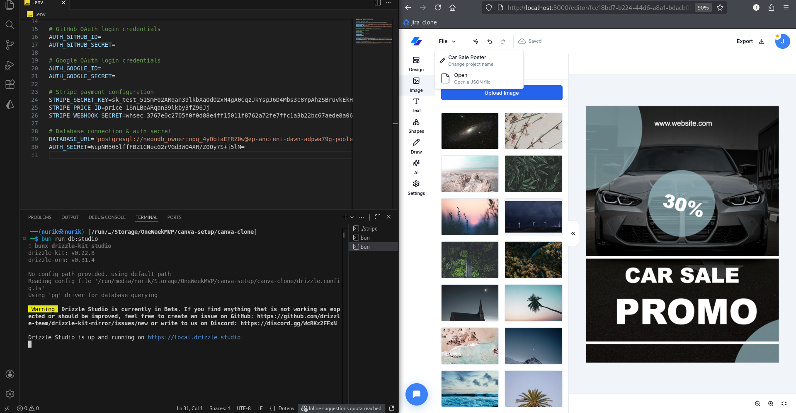
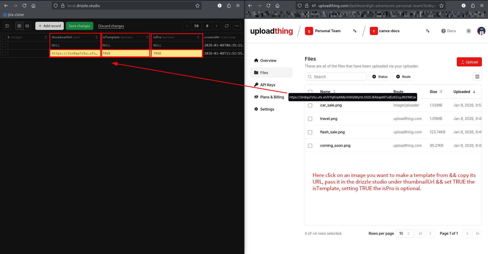
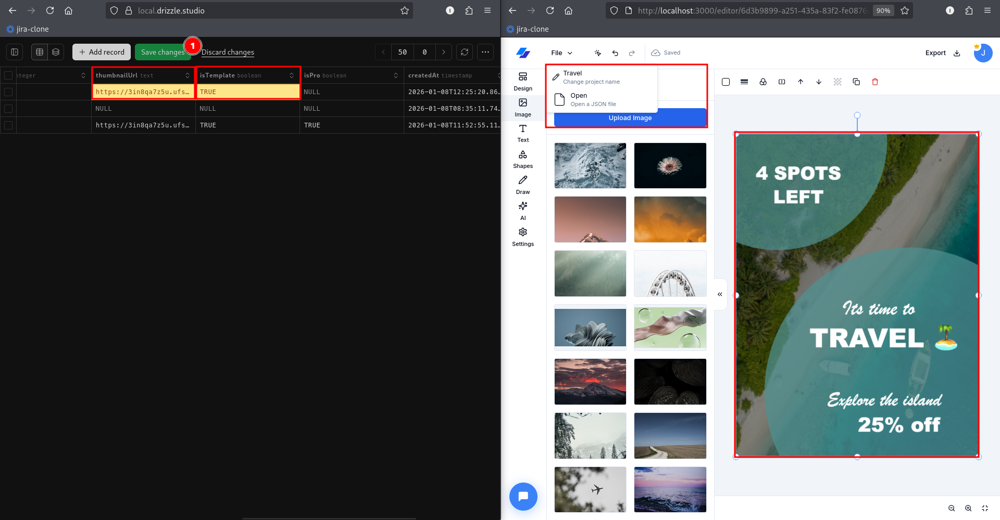
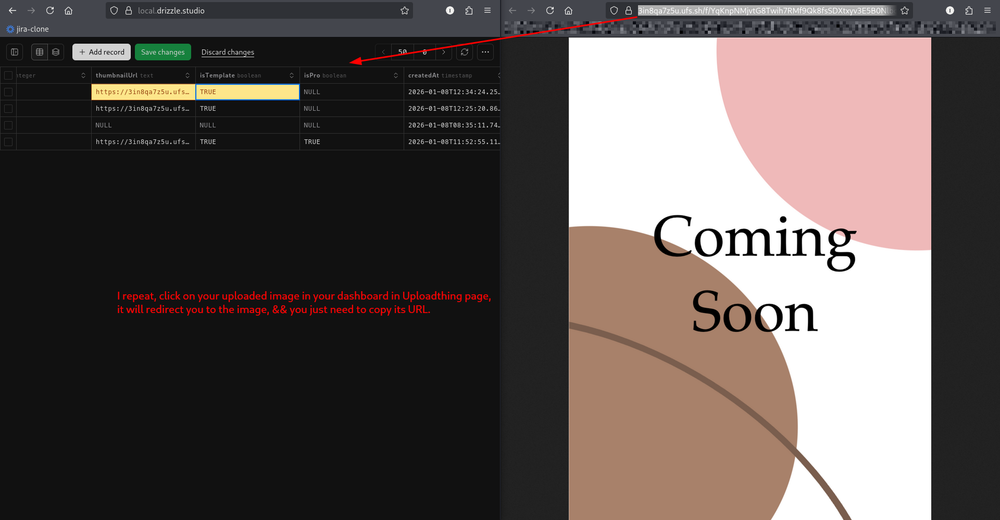
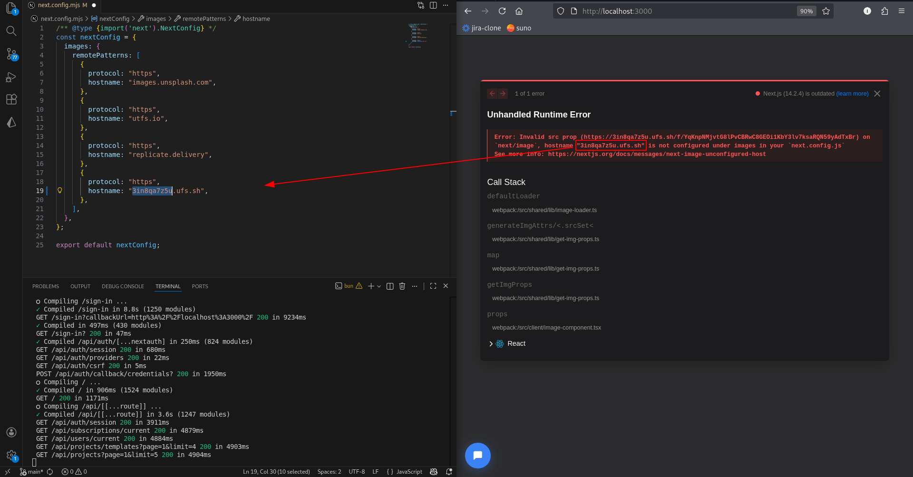
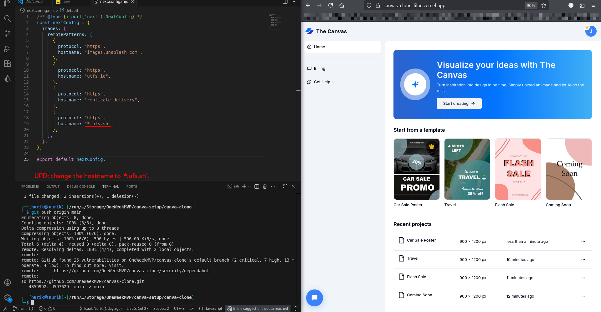
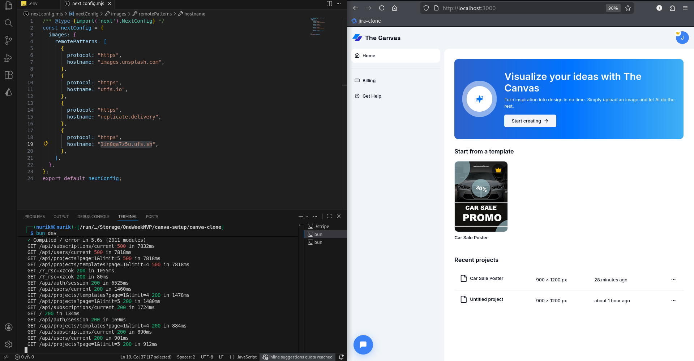

# 07-TEMPLATES-SETUP.md

## Templates Setup

### Step 1: Upload Template Images

1. Go to your UploadThing dashboard: [uploadthing.com](https://uploadthing.com)
2. Select your app
3. Click **"Upload"** or **"Files"**
4. Upload all template images from your `public` folder
   - Example: `car-sale.png`, `travel.png`, `flash-sale.png`, etc.

**Why?** We need the UploadThing URLs to use as thumbnails in the database.

**See:** Fig.7.0, Fig.6.1.

  
<p align="center"><em>Fig.7.0: Upload the PNG images from the public</em></p>

  
<p align="center"><em>Fig.7.1: Upload an image && go to your local drizzle studio</em></p>

---

## Part 2: Configure Templates in Database

### Step 2: Open Drizzle Studio

In your terminal, run:

```bash
bun run db:studio
```

This opens the database GUI at `https://local.drizzle.studio`

### Step 3: Navigate to Templates Table

1. In Drizzle Studio, click on **"templates"** table
2. Click **"Add record"** or manually edit existing records

**See:** Fig.7.2.

  
<p align="center"><em>Fig.7.2: Make the changes && Save</em></p>

### Step 4: Add Template Data

For each template, fill in these fields:

| Field | Value | Example |
|-------|-------|---------|
| `name` | Template name | "Car Sale Poster" |
| `json` | Design JSON (from your template files) | `{"version":"5.3.0",...}` |
| `width` | Canvas width | `900` |
| `height` | Canvas height | `1200` |
| `thumbnailUrl` | UploadThing image URL | Copy from UploadThing |
| `isTemplate` | Must be TRUE | `TRUE` |
| `isPro` | Free or Pro template | `FALSE` or `TRUE` |

### Step 5: Get Image URLs

1. Go back to UploadThing dashboard
2. Click on an uploaded image
3. Copy the full URL (looks like: `https://xxxxxxx.ufs.sh/f/...`)
4. Paste into `thumbnailUrl` field in Drizzle Studio

**See:** Fig.7.3, Fig.7.4.

  
<p align="center"><em>Fig.7.3: Repeat the process & Templates are set!</em></p>

  
<p align="center"><em>Fig.7.4: Copy pass the URL by pressing on the image in Uploadthing page</em></p>


### Step 6: Save Changes

Click **"Save"** in Drizzle Studio for each template.

---

## Part 3: Fix Image Loading (Important!)

### Step 7: Update next.config.js

**Problem:** Templates might not show due to Next.js image optimization restrictions.

**Solution:** Update `next.config.js` to allow UploadThing domains:

```javascript
/** @type {import('next').NextConfig} */
const nextConfig = {
  images: {
    remotePatterns: [
      {
        protocol: "https",
        hostname: "images.unsplash.com",
      },
      {
        protocol: "https",
        hostname: "utfs.io",
      },
      {
        protocol: "https",
        hostname: "replicate.delivery",
      },
      {
        protocol: "https",
        hostname: "*.ufs.sh", // Important: Wildcard for all UploadThing subdomains
      },
    ],
  },
};

export default nextConfig;
```

**Key change:** Use `*.ufs.sh` instead of specific subdomain like `3in8qa7z5u.ufs.sh`

**Why?** UploadThing uses dynamic subdomains that can change.

**See:** Fig.7.5, Fig.7.6.

  
<p align="center"><em>Fig.7.5: Error? No Problem!</em></p>

  
<p align="center"><em>Fig.7.6: Just name the hostname to ‘*ufs.sh’</em></p>

### Step 8: Restart Dev Server

```bash
# Stop server (Ctrl+C)
# Start again
bun dev
```

### Step 9: Verify Templates

1. Go to `http://localhost:3000`
2. You should see templates in the **"Start from a template"** section
3. Click on a template to test it

**See:** Fig.7.7.

  
<p align="center"><em>Fig.7.7: The template is there</em></p>

---

## Repeat for All Templates

Follow Steps 4-6 for each template image you want to add:
- Car Sale Poster
- Travel
- Flash Sale
- Coming Soon
- Any custom templates

---

**✅ Templates setup complete!**

---

**Troubleshooting:**

**Templates not showing:**
1. Check `next.config.js` has `*.ufs.sh` wildcard
2. Verify `thumbnailUrl` is correct in database
3. Ensure `isTemplate` is set to `TRUE`
4. Restart dev server after any config changes

**Images returning 400 error:**
- This means the domain isn't allowed in `next.config.js`
- Add the domain to `remotePatterns` array

---

**Previous:** [06-STRIPE-SETUP.md](./06-STRIPE-SETUP.md)  
**Next:** [08-GITHUB-OAUTH.md](./08-GITHUB-OAUTH.md)

---
