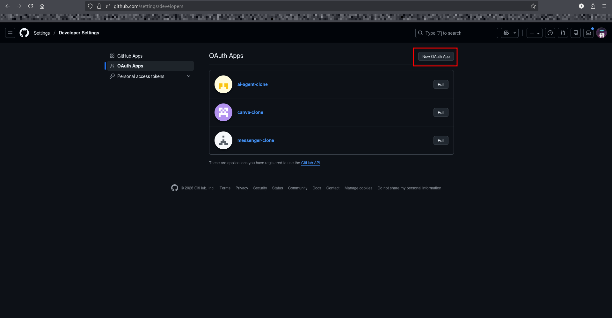
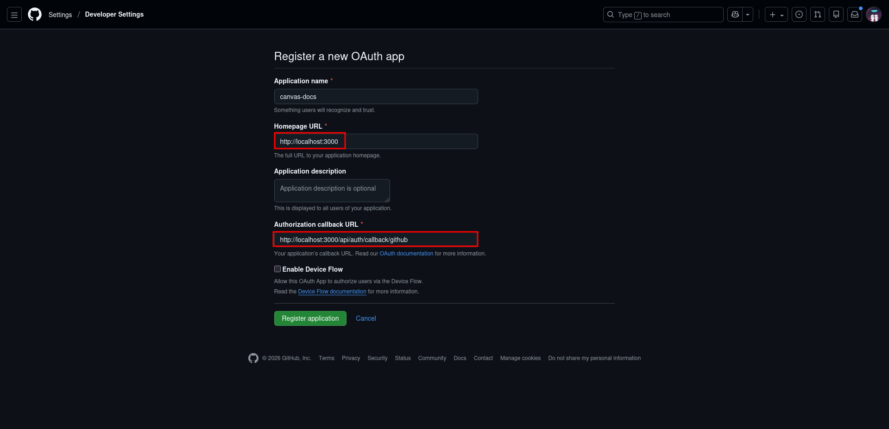
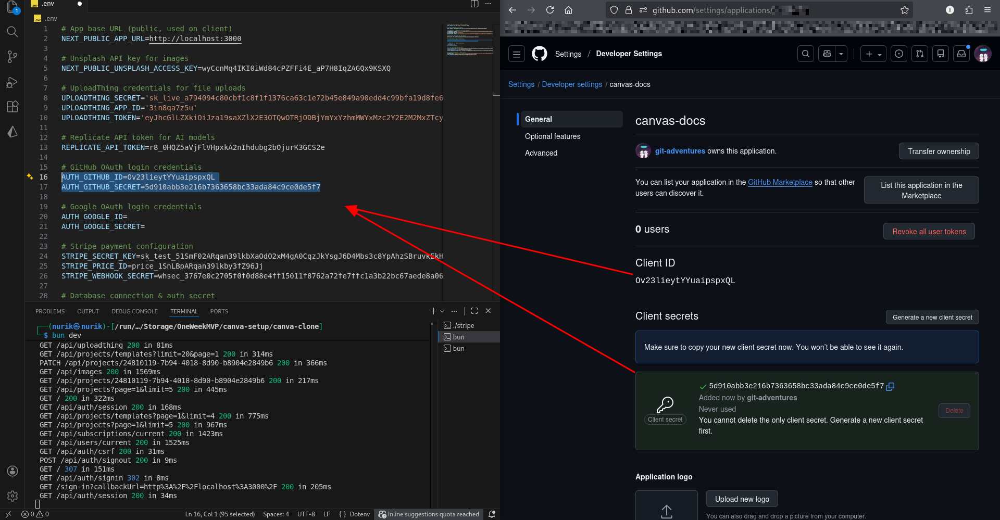
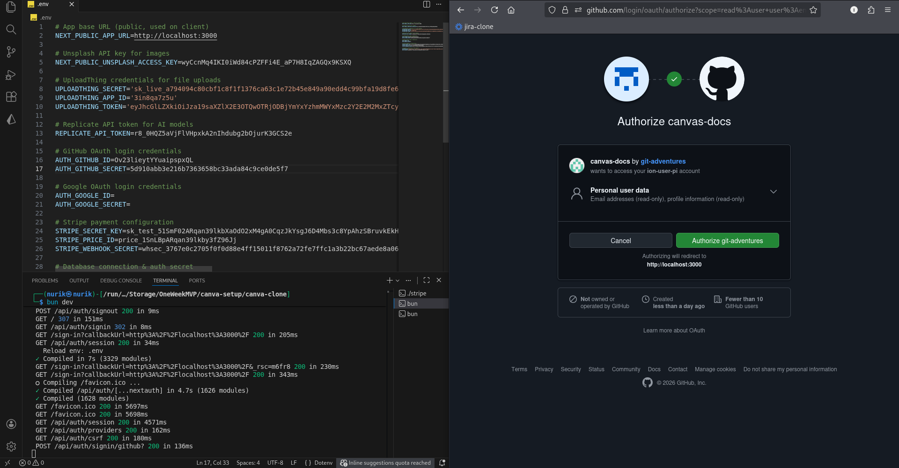

# 08-GITHUB-OAUTH.md

## GitHub OAuth Setup

### Step 1: Go to GitHub Developer Settings

1. Go to [github.com/settings/developers](https://github.com/settings/developers)
2. Make sure you're logged in to GitHub

**See:** Fig.8.0.

  
<p align="center"><em>Fig.8.0: Go to your Github && create a new OAuth App</em></p>

### Step 2: Create New OAuth App

1. Click **"OAuth Apps"** in the left sidebar
2. Click **"New OAuth App"**

### Step 3: Fill in Application Details

Enter these details exactly:

| Field | Value |
|-------|-------|
| **Application name** | Canva Clone (or your choice) |
| **Homepage URL** | `http://localhost:3000` |
| **Application description** | Optional |
| **Authorization callback URL** | `http://localhost:3000/api/auth/callback/github` |

**Important:** The callback URL must be exact!

**See:** Fig.8.1.

  
<p align="center"><em>Fig.8.1: Pass the URL as shown</em></p>

### Step 4: Register Application

Click **"Register application"**

### Step 5: Get Client ID and Secret

1. After registration, you'll see your **Client ID** - copy it
2. Click **"Generate a new client secret"**
3. Copy the **Client Secret** (you won't see it again!)

**See:** Fig.8.2.

  
<p align="center"><em>Fig.8.2: Github is set for localhost:3000</em></p>

### Step 6: Add to Environment File

Open `.env` and add:

```env
GITHUB_CLIENT_ID=your_client_id_here
GITHUB_CLIENT_SECRET=your_client_secret_here
```

### Step 7: Restart Dev Server

```bash
# Stop server (Ctrl+C)
# Start again
bun dev
```

### Step 8: Test GitHub Login

1. Go to `http://localhost:3000`
2. Click **"Sign in with GitHub"**
3. Authorize the application
4. You should be logged in!

**See:** Fig.8.3.

  
<p align="center"><em>Fig.8.3: Github works!</em></p>

---

**✅ GitHub OAuth setup complete!**

---

**Troubleshooting:**

**Redirect URI mismatch error:**
- Make sure callback URL is exactly: `http://localhost:3000/api/auth/callback/github`
- No trailing slash
- Check for typos

**Can't log in with same email:**
- If you already have an account with that email using another method (Google, email), you can't use the same email with GitHub
- Use a different email or delete the existing account

---

**Previous:** [07-TEMPLATES-SETUP.md](./07-TEMPLATES-SETUP.md)  
**Next:** [09-GOOGLE-OAUTH.md](./09-GOOGLE-OAUTH.md)

---
