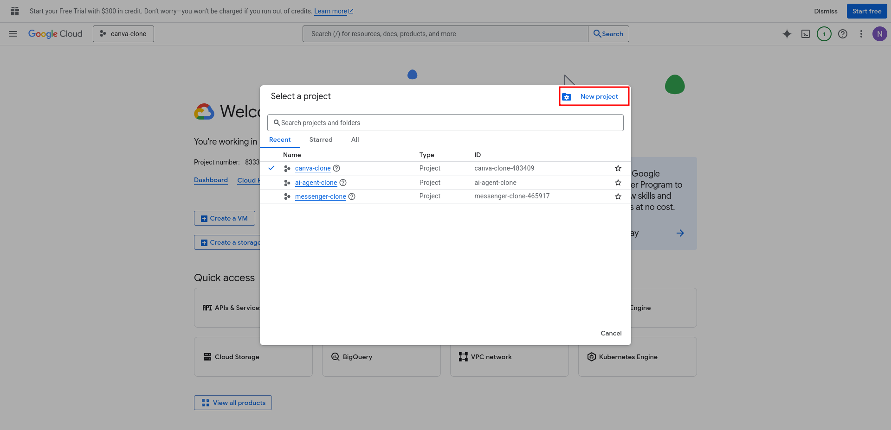
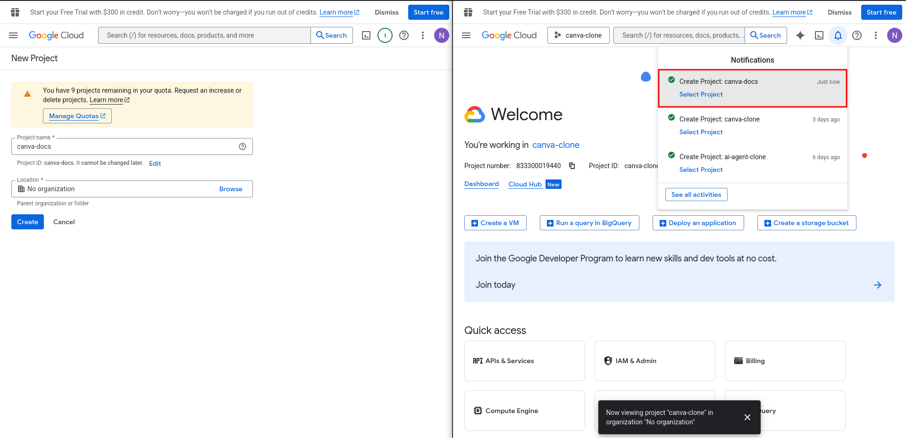
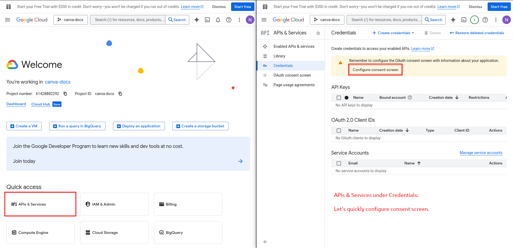
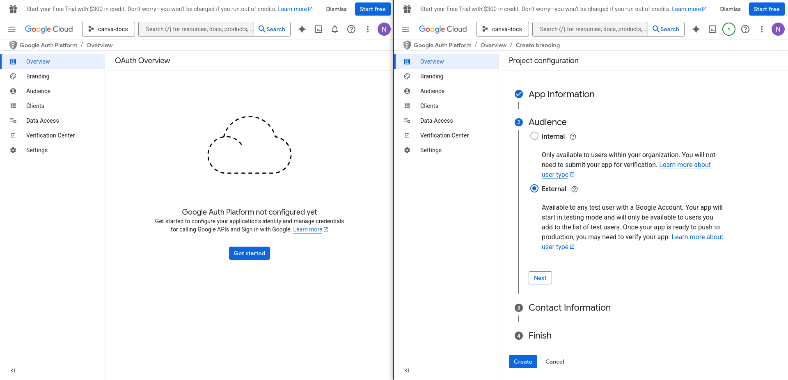
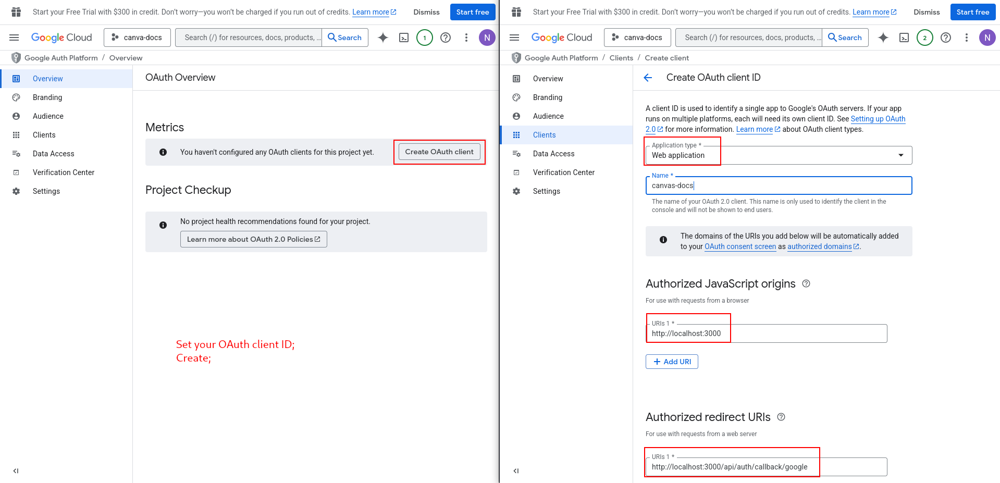
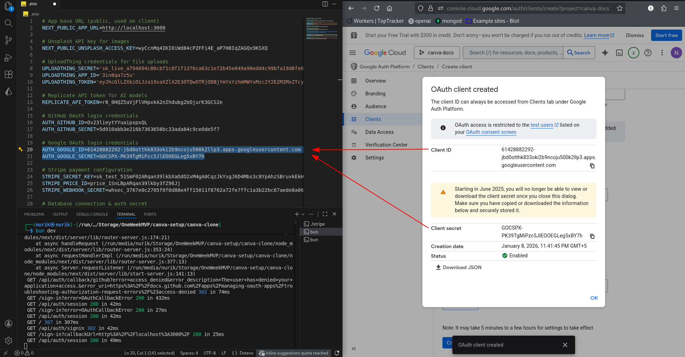
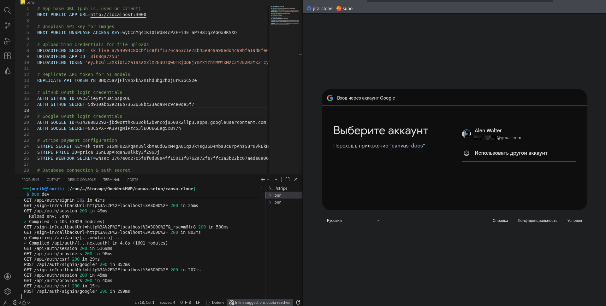
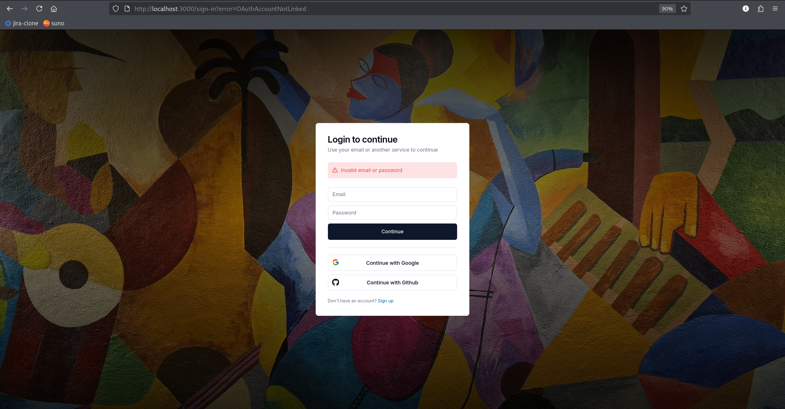

# 09-GOOGLE-OAUTH.md

## Google OAuth Setup

---

## Part 1: Create Google Cloud Project

### Step 1: Go to Google Cloud Console

1. Go to [console.cloud.google.com](https://console.cloud.google.com)
2. Sign in with your Google account

### Step 2: Create New Project

1. Click on the project dropdown (top left)
2. Click **"New Project"**
3. Name your project (e.g., "Canva Clone")
4. Click **"Create"**

**See:** Fig.9.0, Fig.9.1.

  
<p align="center"><em>Fig.9.0: Project Creation</em></p>

  
<p align="center"><em>Fig.9.1: Name your project && Select</em></p>

### Step 3: Select Your Project

Make sure your new project is selected in the dropdown.

---

## Part 2: Configure OAuth Consent Screen

### Step 4: Navigate to OAuth Consent

1. In the left sidebar, go to **"APIs & Services"**
2. Click **"OAuth consent screen"**

**See:** Fig.9.2.

  
<p align="center"><em>Fig.9.2: Head to APIs && Configure</em></p>

### Step 5: Configure Consent Screen

1. Select **"External"** user type
2. Click **"Create"**
3. Fill in required fields:
   - **App name:** Canva Clone (or your choice)
   - **User support email:** Your email
   - **Developer contact email:** Your email
4. Leave other fields as default
5. Click **"Save and Continue"**
6. Click **"Save and Continue"** on Scopes page (no changes needed)
7. Click **"Save and Continue"** on Test users page

**See:** Fig.9.3.

  
<p align="center"><em>Fig.9.3: Finish your Google Auth Configuration</em></p>

---

## Part 3: Create OAuth Credentials

### Step 6: Create OAuth Client ID

1. Go to **"Credentials"** (in left sidebar)
2. Click **"Create Credentials"**
3. Select **"OAuth client ID"**

**See:** Fig.9.4.

  
<p align="center"><em>Fig.9.4: Create OAuth client ID</em></p>

### Step 7: Configure OAuth Client

1. **Application type:** Select **"Web application"**
2. **Name:** Canva Clone OAuth (or your choice)
3. **Authorized JavaScript origins:** Leave empty for now
4. **Authorized redirect URIs:** Click **"Add URI"**
   - Add: `http://localhost:3000/api/auth/callback/google`
5. Click **"Create"**

### Step 8: Copy Client ID and Secret

A popup will show your credentials:
- Copy **Client ID**
- Copy **Client Secret**

**See:** Fig.9.5.

    
<p align="center"><em>Fig.9.5: Client ID && Secret</em></p>

### Step 9: Add to Environment File

Open `.env` and add:

```env
GOOGLE_CLIENT_ID=your_client_id_here
GOOGLE_CLIENT_SECRET=your_client_secret_here
```

### Step 10: Restart Dev Server

```bash
# Stop server (Ctrl+C)
# Start again
bun dev
```

### Step 11: Test Google Login

1. Go to `http://localhost:3000`
2. Click **"Sign in with Google"**
3. Select your Google account
4. Authorize the application
5. You should be logged in!

**See:** Fig.9.6.

  
<p align="center"><em>Fig.9.6: There it is!</em></p>

---

**✅ Google OAuth setup complete!**

---

**Important Notes:**

**Can't use same email for multiple OAuth providers:**
- If you signed up with an email using GitHub, you can't use the same email with Google
- Each OAuth provider requires a unique email
- This is by design to prevent account conflicts

**See:** Fig.9.7.

  
<p align="center"><em>Fig.9.7: You can’t log in with the same account from different OAuths</em></p>

---

**Troubleshooting:**

**Redirect URI mismatch:**
- Ensure redirect URI is exactly: `http://localhost:3000/api/auth/callback/google`
- No trailing slash
- Check for typos

**Access blocked error:**
- Make sure OAuth consent screen is configured
- Check that your email is listed in test users (if in testing mode)

---

**Previous:** [08-GITHUB-OAUTH.md](./08-GITHUB-OAUTH.md)  
**Next:** [10-DEPLOYMENT.md](./10-DEPLOYMENT.md)

---
