# 10-DEPLOYMENT.md

## Deployment to Vercel

---

## Part 1: Push to GitHub

### Step 1: Initialize Git (if not already done)

```bash
git init
```

### Step 2: Add All Files

```bash
git add .
```

### Step 3: Commit Changes

```bash
git commit -m "Initial commit - Canva Clone"
```

### Step 4: Create GitHub Repository

1. Go to [github.com](https://github.com)
2. Click the **"+"** icon (top right)
3. Select **"New repository"**
4. Name it (e.g., "canva-clone")
5. Keep it **Private** (recommended)
6. **Don't** initialize with README
7. Click **"Create repository"**

**See:** Fig.10.0.

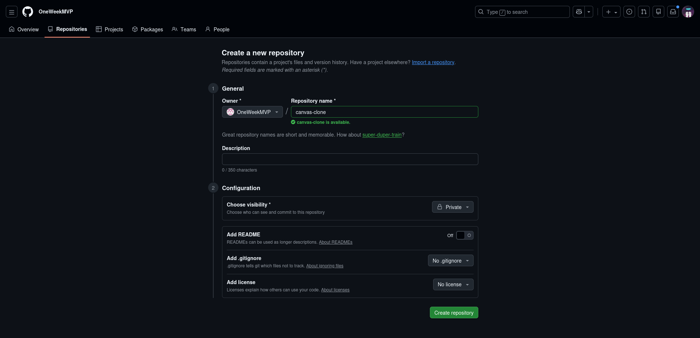  
<p align="center"><em>Fig.10.0: Create a repository</em></p>

### Step 5: Push to GitHub

```bash
git remote add origin https://github.com/your-username/canva-clone.git
git branch -M main
git push -u origin main
```

**Replace** `your-username` with your actual GitHub username.

**See:** Fig.10.1.

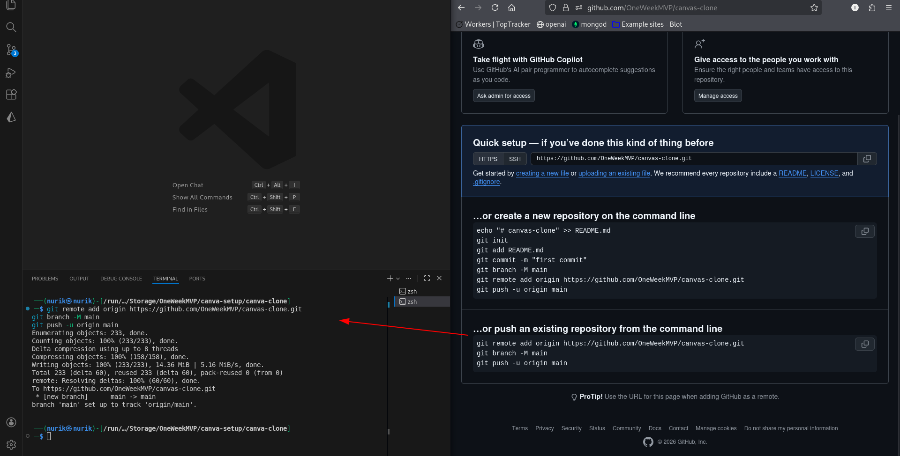  
<p align="center"><em>Fig.10.1: Git push</em></p>

Refresh your GitHub repository page - you should see all your files!

---

## Part 2: Deploy to Vercel

### Step 6: Go to Vercel

1. Go to [vercel.com](https://vercel.com)
2. Sign in with GitHub

### Step 7: Import Repository

1. Click **"Add New"** → **"Project"**
2. Find your `canva-clone` repository
3. Click **"Import"**

**See:** Fig.10.2.

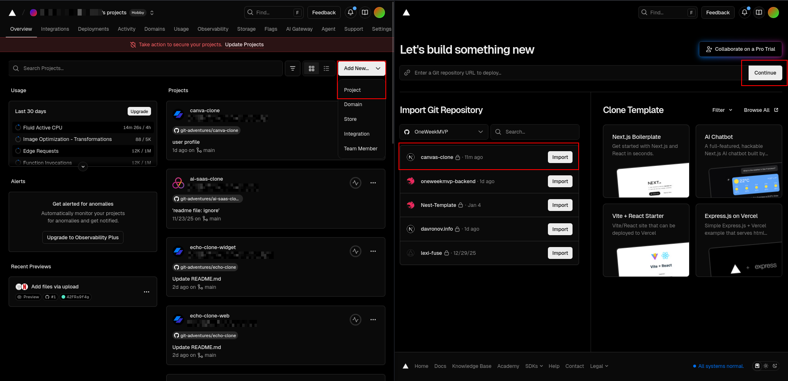  
<p align="center"><em>Fig.10.2: Import your repository from Gihub</em></p>

### Step 8: Configure Project

1. **Framework Preset:** Next.js (should auto-detect)
2. **Root Directory:** Leave as default
3. **Build Command:** Leave as default
4. **Output Directory:** Leave as default
5. Click **"Deploy"**

**See:** Fig.10.3.

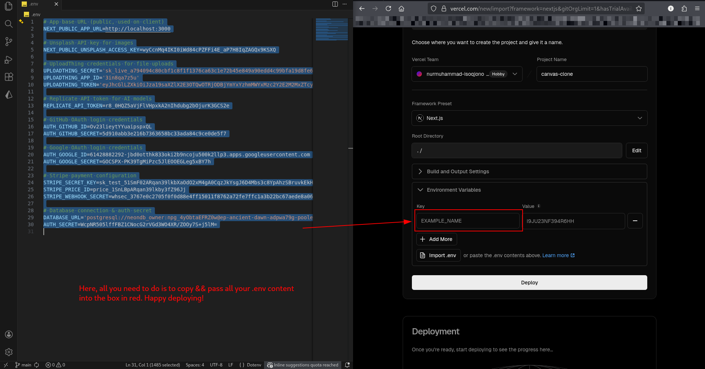  
<p align="center"><em>Fig.10.3: Happy Deploying!</em></p>

Wait for deployment to complete (~2-3 minutes).

### Step 9: Copy Your Domain

After deployment:
1. Copy your Vercel domain (e.g., `your-app.vercel.app`)
2. Keep this for the next steps

**See:** Fig.10.4.

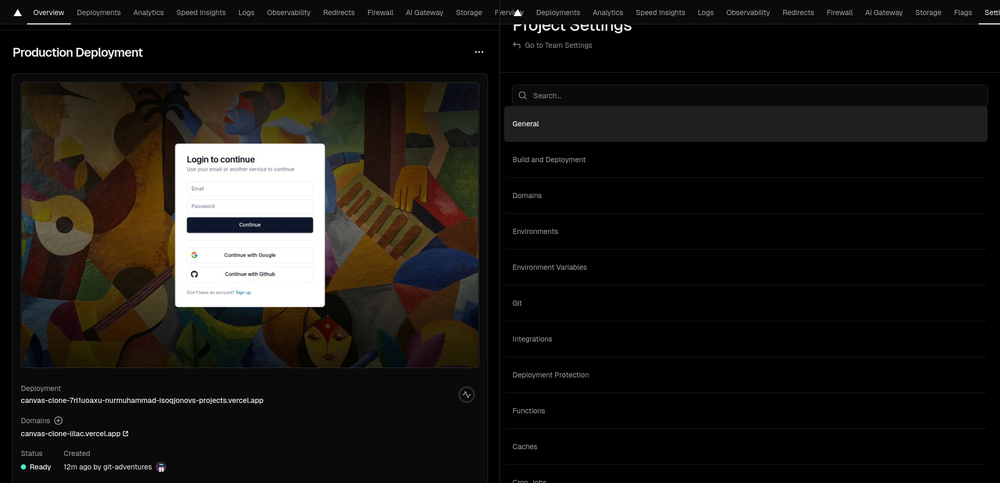  
<p align="center"><em>Fig.10.4: Copy your Domain name (URL) && got to Settings Environment Variables</em></p>

---

## Part 3: Update Environment Variables

### Step 10: Add Environment Variables to Vercel

1. In Vercel dashboard, go to your project
2. Click **"Settings"** → **"Environment Variables"**
3. Add **ALL** variables from your local `.env` file:

```env
DATABASE_URL=
AUTH_SECRET=
NEXT_PUBLIC_APP_URL=https://your-app.vercel.app
NEXT_PUBLIC_UNSPLASH_ACCESS_KEY=
UPLOADTHING_SECRET=
UPLOADTHING_APP_ID=
UPLOADTHING_TOKEN=
REPLICATE_API_TOKEN=
STRIPE_SECRET_KEY=
STRIPE_PRICE_ID=
STRIPE_WEBHOOK_SECRET=
GITHUB_CLIENT_ID=
GITHUB_CLIENT_SECRET=
GOOGLE_CLIENT_ID=
GOOGLE_CLIENT_SECRET=
```

**Important:** Update `NEXT_PUBLIC_APP_URL` to your Vercel domain!

**See:** Fig.10.5.

  
<p align="center"><em>Fig.10.5: Save</em></p>

### Step 11: Save and Redeploy

1. Click **"Save"**

---

## Part 4: Configure Stripe Webhook for Production

### Step 12: Create Production Webhook

1. Go to Stripe Dashboard: [dashboard.stripe.com](https://dashboard.stripe.com)
2. Go to **"Developers"** → **"Webhooks"**
3. Click **"Add endpoint"**

**See:** Fig.10.6.

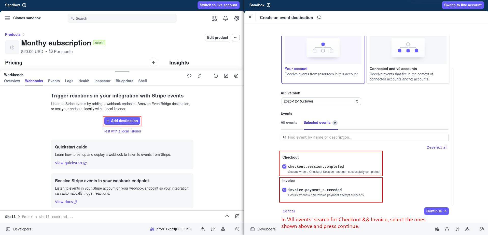  
<p align="center"><em>Fig.10.6: Stripe Events</em></p>

### Step 13: Configure Webhook

1. **Endpoint URL:** `https://your-app.vercel.app/api/webhooks/stripe`
2. **Description:** Production webhook (optional)
3. Click **"Select events"**
4. Select these events:
   - `checkout.session.completed`
   - `invoice.payment_succeeded`
   - `customer.subscription.updated`
   - `customer.subscription.deleted`
5. Click **"Add endpoint"**

**See:** Fig.10.7.

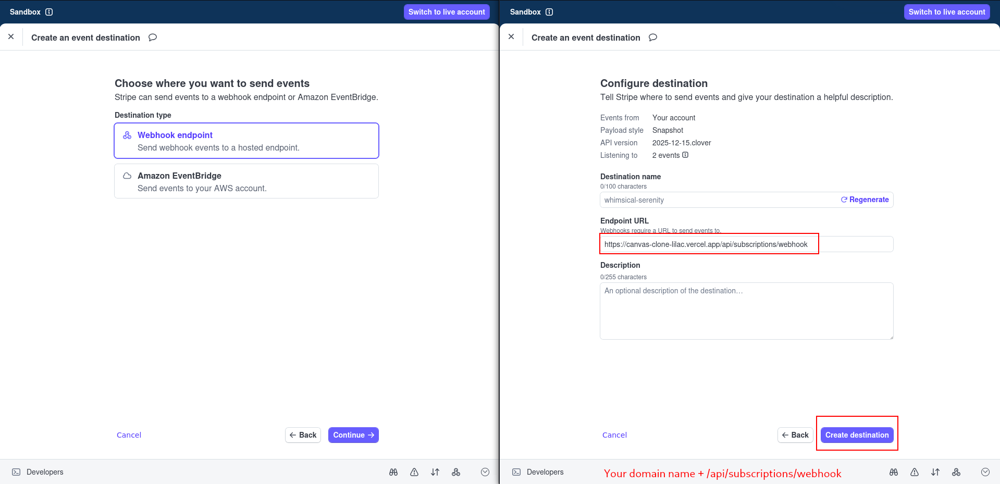  
<p align="center"><em>Fig.10.7: Webhook Destination</em></p>

### Step 14: Get Webhook Secret

1. Click on your newly created webhook
2. Copy the **Signing secret** (starts with `whsec_`)

**See:** Fig.10.8.

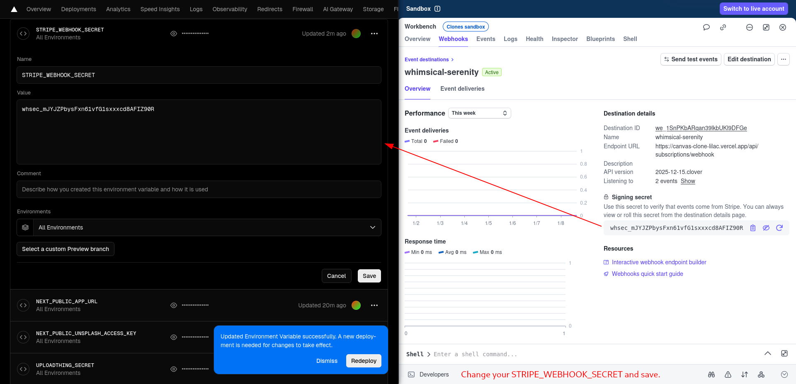  
<p align="center"><em>Fig.10.8: Save</em></p>

### Step 15: Update Vercel Environment Variable

1. Go back to Vercel → **Settings** → **Environment Variables**
2. Find `STRIPE_WEBHOOK_SECRET`
3. Update it with the **production** webhook secret
4. Click **"Save"**

---

## Part 5: Update OAuth Callbacks

### Step 16: Update GitHub OAuth

1. Go to [github.com/settings/developers](https://github.com/settings/developers)
2. Click on your OAuth app
3. Update:
   - **Homepage URL:** `https://your-app.vercel.app`
   - **Authorization callback URL:** `https://your-app.vercel.app/api/auth/callback/github`
4. Click **"Update application"**

**See:** Fig.10.9.

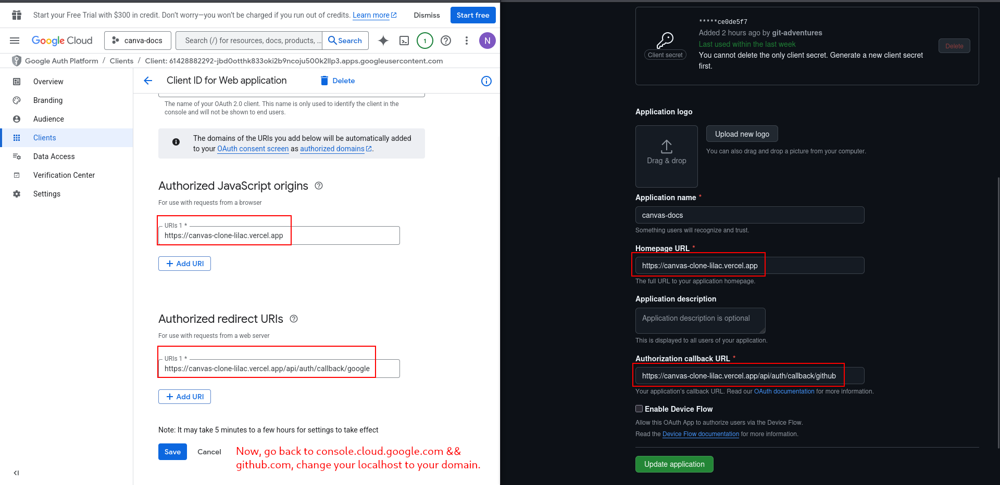  
<p align="center"><em>Fig.10.9: Change the localhost to your domain name</em></p>

### Step 17: Update Google OAuth

1. Go to [console.cloud.google.com](https://console.cloud.google.com)
2. Select your project
3. Go to **"APIs & Services"** → **"Credentials"**
4. Click on your OAuth client
5. Under **"Authorized redirect URIs"**, click **"Add URI"**
6. Add: `https://your-app.vercel.app/api/auth/callback/google`
7. Click **"Save"**

---

## Part 6: Final Deployment

### Step 18: Redeploy on Vercel

1. Go to Vercel dashboard
2. Click **"Deployments"**
3. Click **"Redeploy"** on the latest deployment
4. Wait for deployment to complete

**See:** Fig.10.10.

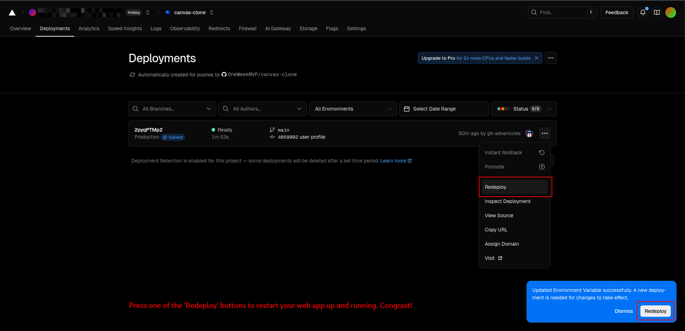  
<p align="center"><em>Fig.10.10: Redeploy</em></p>

### Step 19: Test Production App

1. Visit your Vercel domain: `https://your-app.vercel.app`
2. Test all features:
   - ✅ Sign up with email
   - ✅ Sign in with GitHub
   - ✅ Sign in with Google
   - ✅ Upload images
   - ✅ Use templates
   - ✅ Subscribe to Pro
   - ✅ Generate AI images
   - ✅ Remove backgrounds

**See:** Fig.10.11.

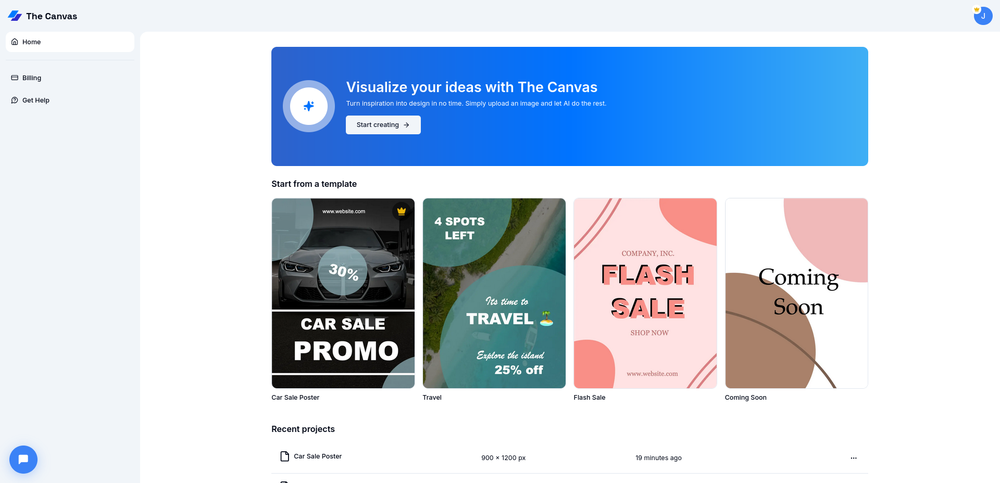  
<p align="center"><em>Fig.10.11: Canva Clone</em></p>

---

**🎉 Congratulations! Your Canva Clone is now live!**

---

## Important Notes

**After deployment:**
- Your app is live and accessible worldwide
- Stripe will process real payments (use test mode for testing)
- All features should work identically to local development
- Monitor your Vercel dashboard for errors and analytics

**Cost considerations:**
- Vercel: Free tier (hobby plan)
- Neon: Free tier
- UploadThing: Free tier (with limits)
- Unsplash: Free tier
- Replicate: Pay-per-use (AI generation costs)
- Stripe: No monthly fee (transaction fees apply)

---

**Troubleshooting:**

**Build failed on Vercel:**
- Check build logs for errors
- Ensure all dependencies are in `package.json`
- Verify environment variables are set correctly

**OAuth not working:**
- Double-check callback URLs match exactly
- Include `https://` in production URLs
- No trailing slashes

**Stripe webhooks not working:**
- Verify webhook URL is correct
- Check that signing secret is from production endpoint
- Monitor webhook logs in Stripe dashboard

**Images not loading:**
- Verify `next.config.js` includes all domains
- Check UploadThing URLs are accessible
- Redeploy after config changes

---

**Previous:** [09-GOOGLE-OAUTH.md](./09-GOOGLE-OAUTH.md)  
**Next:** [11-TROUBLESHOOTING.md](./11-TROUBLESHOOTING.md)

---
